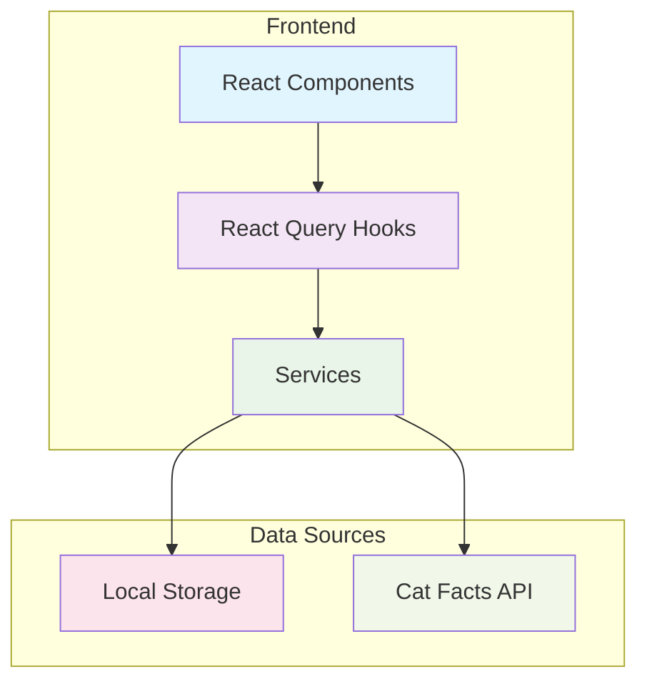

# Cat Expense Tracker 🐱

A beautiful and functional web application for tracking cat-related expenses with a modern UI and excellent user experience.

## Features

### 🎯 Main Functionality

- **Add Expenses**: Add new cat expenses with item name, category, and amount
- **Delete Expenses**: Select and delete multiple expenses using checkboxes
- **Top Categories**: Automatically highlights the highest spending categories
- **Random Cat Facts**: Get a random cat fact every time you open the expense form
- **Local Storage**: All data is persisted in browser local storage

### 🏗️ Architecture

The application has the following layered architecture:



**High-Level Overview:**

- **React Components**: UI layer built with shadcn/ui components
- **React Query**: State management and data fetching
- **Services**: Business logic for expenses and external API integration
- **Data Sources**: Local storage for persistence and external API for cat facts

## Documentation

For detailed UML sequence diagrams showing the data flow for fetching, adding, and deleting expenses, see [docs/uml-diagrams.md](./docs/uml-diagrams.md).

## Technology Stack

- **Frontend**: React 19 with TypeScript
- **Styling**: Tailwind CSS with custom gradients
- **UI Components**: shadcn/ui components
- **State Management**: TanStack Query (React Query)
- **Form Handling**: React Hook Form with Zod validation
- **Build Tool**: Vite
- **Package Manager**: pnpm

## Getting Started

### Prerequisites

- Node.js >= 22.0.0
- pnpm >= 10.9.0

### Installation

#### Option 1: Quick Setup (Recommended)

1. Clone the repository:

```bash
git clone <repository-url>
cd cat-expense
```

2. Run the automated setup:

```bash
make setup
```

This will automatically:

- Install the correct Node.js version (using nvm)
- Install/upgrade pnpm to the required version
- Install all project dependencies

3. Start the development server:

```bash
make dev
```

4. Open your browser and navigate to `http://localhost:3000`

#### Option 2: Manual Setup

1. Install nvm (Node Version Manager):

```bash
curl -o- https://raw.githubusercontent.com/nvm-sh/nvm/v0.39.0/install.sh | bash
```

Then restart your terminal or run:

```bash
source ~/.bashrc  # or source ~/.zshrc for zsh
```

2. Install Node.js and enable corepack:

```bash
nvm install
nvm use
npm install -g corepack
```

3. Clone the repository:

```bash
git clone <repository-url>
cd cat-expense
```

4. Enable corepack and install pnpm:

```bash
corepack enable
corepack prepare pnpm@10.9.0 --activate
```

5. Install dependencies:

```bash
pnpm install
```

6. Start the development server:

```bash
pnpm dev
```

7. Open your browser and navigate to `http://localhost:3000`

### Available Scripts

#### Using Makefile (Recommended)

- `make setup` - Complete development environment setup
- `make dev` - Start development server
- `make build` - Build for production
- `make preview` - Preview production build
- `make test` - Run tests
- `make test-ui` - Run tests with UI
- `make test-coverage` - Run tests with coverage
- `make lint` - Run ESLint
- `make clean` - Clean build artifacts
- `make help` - Show all available commands

#### Using pnpm directly

- `pnpm dev` - Start development server
- `pnpm build` - Build for production
- `pnpm preview` - Preview production build
- `pnpm test` - Run tests
- `pnpm lint` - Run ESLint

## Usage

### Adding Expenses

1. Click the "Add Expense" button
2. Fill in the required fields:
   - **Item Name**: Name of the cat item (required)
   - **Category**: Choose from Food, Furniture, or Accessory (required)
   - **Amount**: Cost in USD (required, minimum $0.01)
3. Enjoy the random cat fact while filling out the form! 🐱
4. Click "Add Expense" to save

### Managing Expenses

- **View**: All expenses are displayed in a clean table format
- **Select**: Use checkboxes to select multiple expenses
- **Delete**: Click "Delete Selected" to remove selected expenses
- **Top Categories**: Highest spending categories are automatically highlighted with a purple gradient

### Data Persistence

All expense data is automatically saved to your browser's local storage, so your data will persist between sessions.

## Project Structure

```
src/
├── components/
│   ├── expense-page.tsx      # Main page component
│   ├── expense-table.tsx     # Expense table wrapper
│   ├── expense-form.tsx      # Add expense dialog
│   ├── expense-list/         # Expense list components
│   │   ├── expense-list.tsx      # Main list component
│   │   ├── expense-table-view.tsx # Desktop table view
│   │   ├── expense-card-view.tsx  # Mobile card view
│   │   └── index.ts              # Exports
│   ├── form-fields/         # Reusable form field components
│   └── shadcn/              # UI components
├── constants/
│   └── expense-constants.ts # Application constants
├── hooks/
│   └── use-expenses.ts      # React Query hooks
├── services/
│   ├── expense-service.ts   # Local storage operations
│   └── cat-fact-service.ts  # Cat facts API
├── types/
│   └── expense.ts          # TypeScript type definitions
└── App.tsx                 # Main app component
```

## API Integration

The application integrates with the [Cat Facts API](https://catfact.ninja/) to display random cat facts in the expense form dialog.

## Contributing

1. Fork the repository
2. Create a feature branch
3. Make your changes
4. Add tests if applicable
5. Submit a pull request

## License

This project is licensed under the MIT License.
