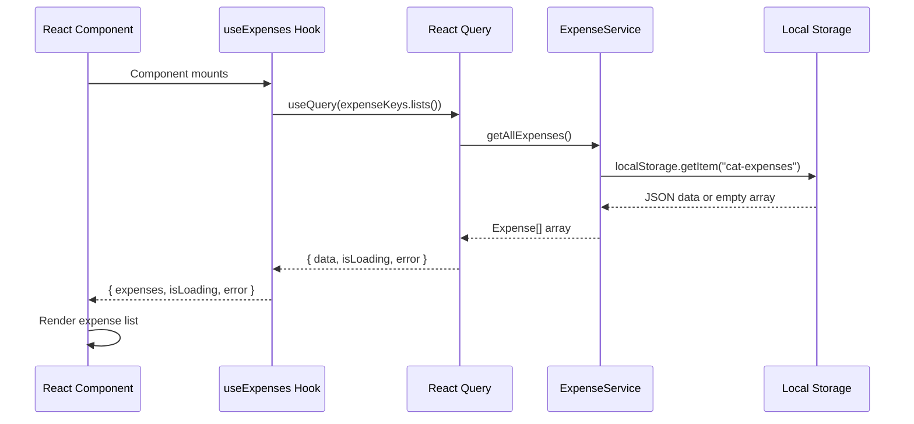
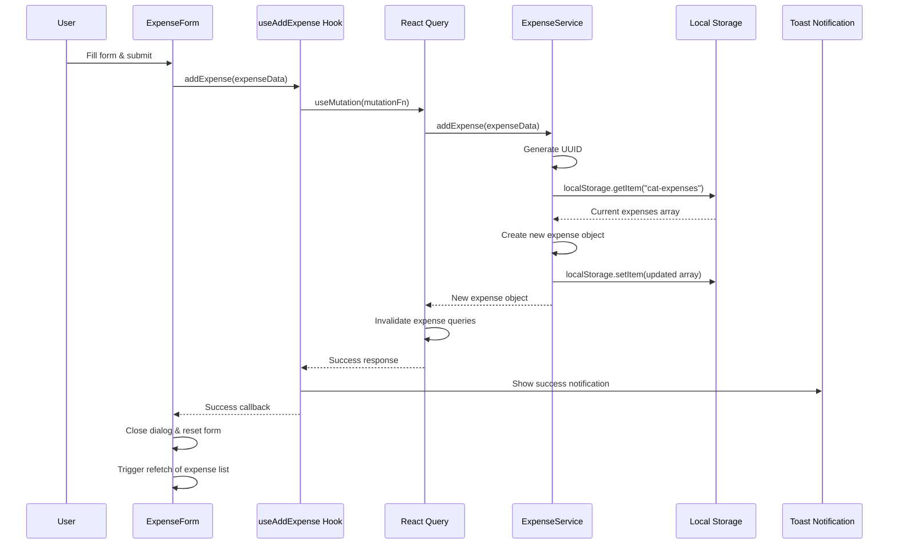
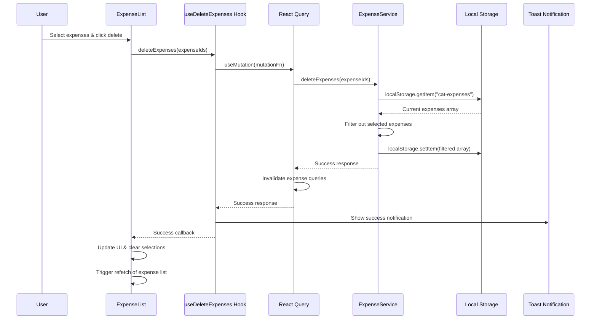
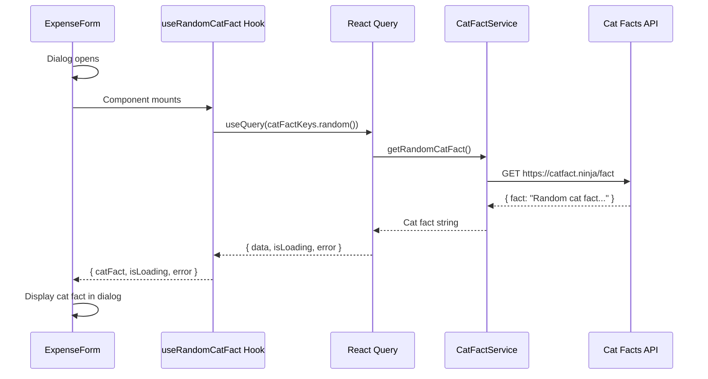
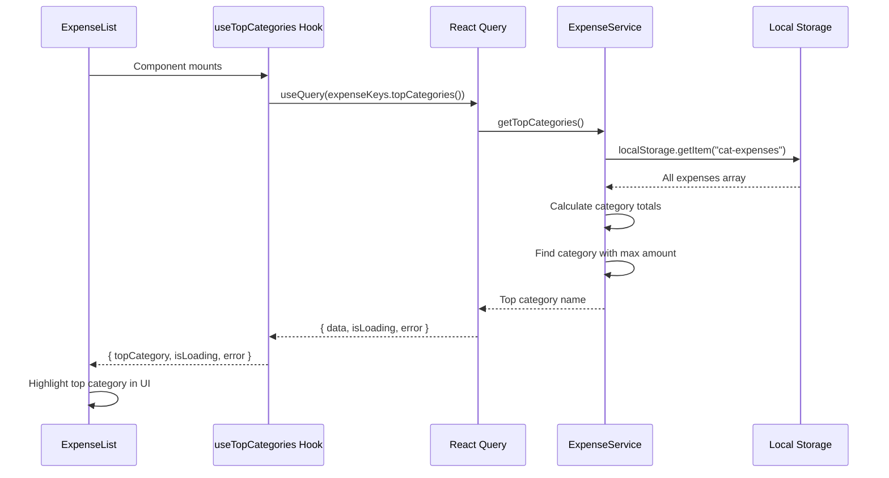

# UML Sequence Diagrams - Cat Expense Tracker

This document contains UML sequence diagrams showing the data flow for key operations in the Cat Expense Tracker application.

## 1. Fetch Expenses Flow

## 2. Add Expense Flow

## 3. Delete Expenses Flow

## 4. Fetch Cat Facts Flow

## 5. Top Categories Calculation Flow

## Key Components

### React Query Hooks

- `useExpenses()` - Fetches all expenses
- `useAddExpense()` - Adds new expense
- `useDeleteExpenses()` - Deletes selected expenses
- `useRandomCatFact()` - Fetches random cat fact
- `useTopCategories()` - Calculates top spending category

### Services

- `ExpenseService` - Handles local storage operations for expenses
- `CatFactService` - Handles external API calls for cat facts

### Data Flow Pattern

1. **UI Components** trigger actions
2. **React Query Hooks** manage state and caching
3. **Services** handle business logic and data operations
4. **Local Storage/APIs** provide data persistence
5. **Toast Notifications** provide user feedback
6. **Query Invalidation** ensures data consistency
